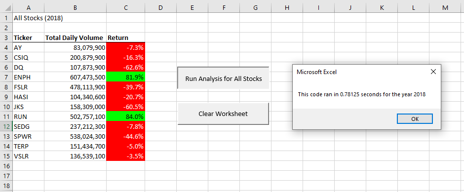
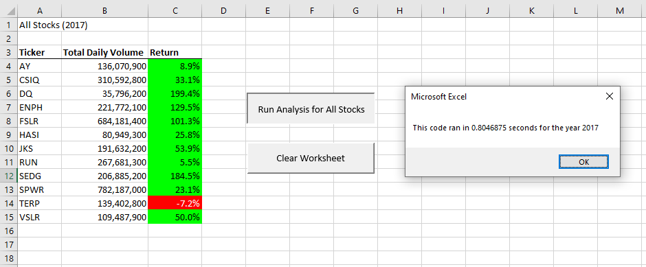

                                                                                           Michelle Werner (4/17/2022)
# Stock Analysis: VBA Code Refactoring & Measuring Performance 
---

## Overview of Project

Intially this project was about client Steve, who was evaluating green energy stocks for his parents. The initial analysis of the DQ stock they had chosen indicated that it had lost value and wasn't the best investment. Following that discovery, Steve asked for help to design a program that could look at multiple stocks simultaneously and compare changes in their stock values. 

Pictured: Steve's Stock Analysis 

### Purpose

When writing a program to compare multiple stocks and their total value increases and decreases, and thinking of how the program could "scale" even further in the future, a few things seemed relevant: visual clarity, variety and timing. Adding buttons and visual formatting to the program made it more easily understood at a glance, and the program was improved with the ability to access differentspreadsheets from multiple stock years. The final refactoring of the program involves invesitgating timing.

As the data increases, saving time on the computation becomes useful - and interesting. For this final re-write of the program, we are going to see if we can the speed of two different code methods of finding the begining and ending price comparisons and totaling them to see which is more efficient. This type of adjustment to our original code is referred to as "refactoring". 

For more on refactoring visit: https://www.bmc.com/blogs/code-refactoring-explained/

## Results

Below are four images, the first show the results from the original program, and the last two are the "refactored" images:

Figure 1: Initial timing, 2018 Green Stock Analysis 

Figure 2: Initial timing, 2017 Green Stock Analysis 

The figures above display the results and timing of our intial program coding. You can see that for the 2018 data, the timing for calculating the results is indicated as 66915.74 seconds and for the 2017 run, the timing is 66889.4 seconds.

### Refactored

Below are the improved timings with our re-factored code. In this case the timings returned are 0.78125 for 2018 and .8046875 for 2017.

Figure 3: FINAL timing, 2018 Green Stock Analysis Refactored

Figure 4: FINAL timing, 2017 Green Stock Analysis Refactored

---
In general, refactoring code is the practice of cleaning up code. A programmer may write a program with code that is loaded with redundancy (or "dirty") because it is more simple to test and debug or becuase they need to quickly "get er done".  But cleaner, more succinct code is highly valued by anyone who may need to edit it in the future. So it is always a "best practice" to consider refactoring as the cleaner the code, the easier it is to maintain and to add future features to. 

"The act of refactoring – changing tiny pieces of code with no front-end purpose – may seem unimportant when compared to higher priority tasks. But the cumulative effect from such changes is significant and can lead to a better-functioning team and approach to programming."  (BMC blogs,  Stephen Watts &Chrissy Kidd, 2018, https://www.bmc.com/blogs/code-refactoring-explained/)

For our VBA challenge, we have successfully improved our program. Refactoring has allowed us to have cleaner code with more streamlined functionality, but it has also sped up calculaton timing. By adding one more array, "tickerIndex", we were able to have the program loop less, improving efficiency and saving valuable time. The refactored version of our project has an advantage over our previous version because ultimately, it can handle more calculations in a fraction of the time it took before.

One thing to note though, while the refactored code in our program is definitely faster, the timings that were returned seem a bit off (as the difference was mere seconds and not hours as the timings seem to indicate). 

Figuring that out could be our next challenge!
