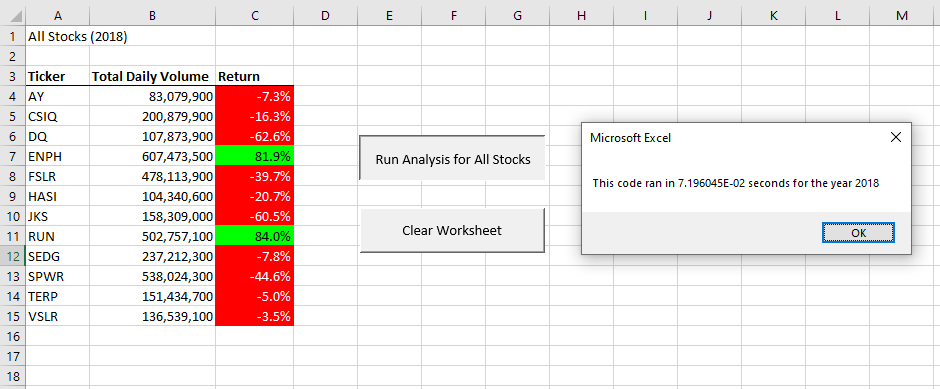

<!--                                                                                           Michelle Werner (4/17/2022)-->
# Stock Analysis: VBA Code Refactoring & Measuring Performance 
---

## Overview of Project

Initially this project was about client Steve, who was evaluating green energy stocks for his parents. The initial analysis of the DQ stock they had chosen indicated that it had lost value and wasn't the best investment. Following that discovery, Steve asked for help to design a program that could look at multiple stocks simultaneously and compare changes in their stock values. 

<!--

Pictured: Steve's Stock Analysis -->

### Purpose

When writing a program to compare multiple stocks and their total value increases and decreases, and thinking of how the program might be need to "scale" up even further in the future, a few things seemed relevant: visual clarity, variety and timing. Adding buttons and visual formatting to the program made it more easily understood at a glance, and the program was much improved with the added ability to access different spreadsheets from multiple stock years. The final refactoring of the program involves investigating timing.

As the data comparison demand increases, saving time on the computation becomes useful - and interesting. For this final re-write of the program, we are going to see if we can test the speed of two different code methods used to find  and total the beginning and ending price comparisons to see which is more efficient. This type of adjustment to our original code is referred to as "refactoring". Our findings and the value of refactoring this VBA code will be discussed further in the Results section below.

<!-- For more on refactoring visit: https://www.bmc.com/blogs/code-refactoring-explained/ -->
---
## Results

Below are six screenshots of the program results, the first two show the results from the original program, the next two are from the first attempt at refactoring in which one array was added, and the last two are the FINAL three-array refactored program images:

Figure 1: Initial timing, 2018 Green Stock Analysis 

Figure 2: Initial timing, 2017 Green Stock Analysis 

The figures above display the results and timing of my initial program coding. You can see that for the 2018 data, the timing for calculating the results is indicated as 66915.74 seconds and for the 2017 run, the timing is 66889.4 seconds.

### Refactored

Below are the improved timings with my refactored code. In this case the timings returned are 0.78125 for 2018 and 0.8046875 for 2017 - a big improvement! Under the figures for each of the two years is a view of the refactored code used to run these timings.

Figure 3: Improved timing, 2018 Green Stock Analysis Refactored with one new array

Figure 4: Improved timing, 2017 Green Stock Analysis Refactored with one new array

Figure 5: Refactored VBA Challenge Code with one new array

### FINAL Refactoring with 3 Arrays
The program can be further improved by coding three arrays for the starting, ending and total volume values. Below is the FINAL even more improved three-array timings (Figures 6 & 7) and the FINAL refactored code (Figure 8). In this FINAL version the timings returned are 0.07196045 for 2018 and 0.1159668 for 2017.

Figure 6: FINAL timing, 2018 Green Stock Analysis Refactored with three arrays

Figure 7: FINAL timing, 2017 Green Stock Analysis Refactored with three arrays

Figure 8: FINAL Refactored VBA Challenge Code with three arrays

---
## Summary
<!--In general, refactoring code is the practice of cleaning up code. A programmer may write a program with code that is loaded with redundancy ("dirty" code) because it is more simple to test and debug or because of time constraints, but cleaner, more succinct code is highly valued - especially by anyone who may need to edit it in the future. It is always a "best practice" to consider refactoring; the cleaner the code, the easier it is to maintain and to add future features to. 

  "The act of refactoring – changing tiny pieces of code with no front-end purpose – may seem unimportant when compared to higher priority tasks. But the cumulative effect from such changes is significant and can lead to a better-functioning team and approach to programming."  (BMC blogs,  Stephen Watts &Chrissy Kidd, 2018, https://www.bmc.com/blogs/code-refactoring-explained/)-->

For this VBA challenge, I have successfully improved my program by adding arrays and simplifying the amount of work the program had to do. Refactoring has allowed for cleaner code with more streamlined functionality, but it has also sped up calculation timing. By adding one more array, "tickerIndex", I was able to have the program loop less, improving efficiency and saving valuable time. Adding three arrays made even more improvements! The FINAL refactored version of this project has an advantage over both previous versions because ultimately, it can handle more calculations in far less time than it took in the original version.

<!--One thing to note though, while the refactored code in our program is definitely faster, the timings that were returned seem a bit off (as the difference between versions was mere seconds and not minutes and/or hours as the timings seem to indicate). Figuring that out could be our next challenge.-->
